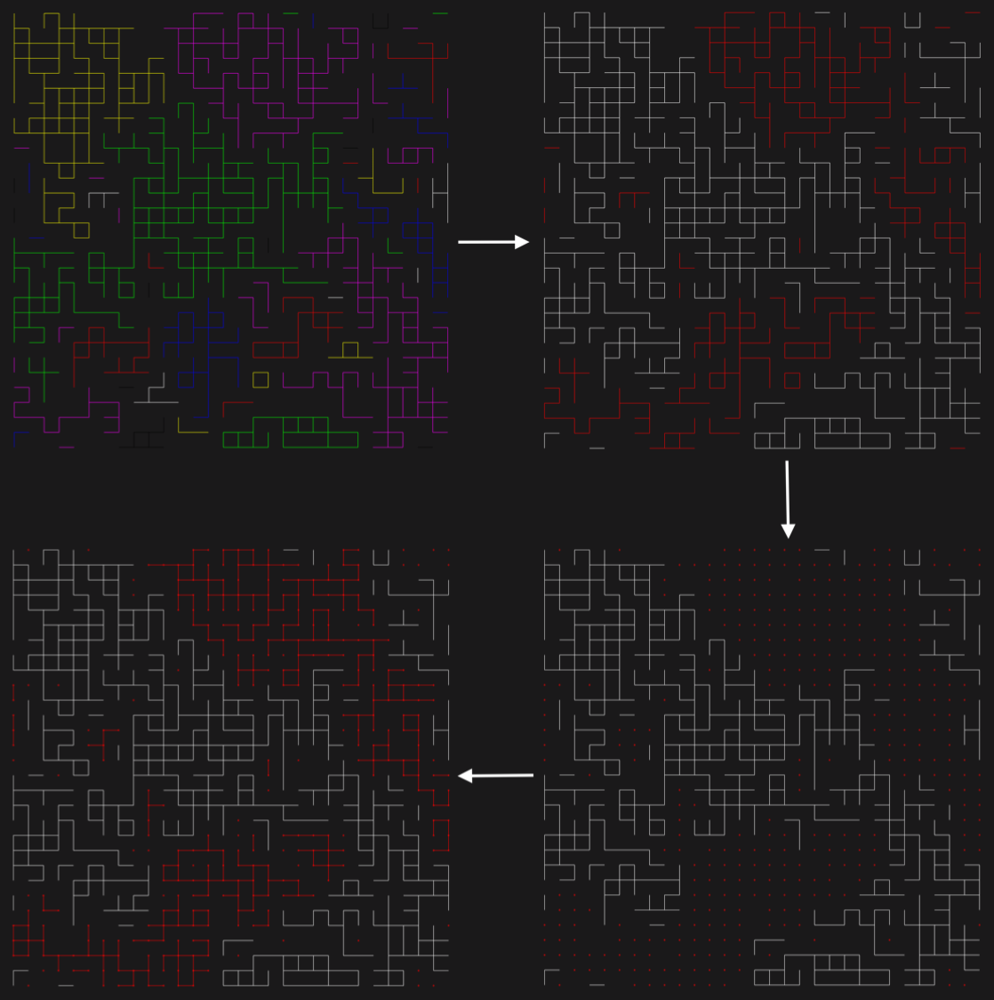

#Chayes-Machta algorithm: generating Potts configurations with $q\in \mathrm{R}^+$

This program is written in order to generate rectangular Potts grids at their critical point. Not only does this algorithm use efficient Monte Carlo methods, but it allows for real $q$ as opposed to only integers. For example, this allows to study the behaviour of the Potts model around the $q = 4$ point, where the system switches from first-order phase transition to second-order phase transition.

## Terminology

* **Key**: a key is simply a node of the grid. It is characterized by a pair of integers (_i_, _j_).
* **Link**: a link is an edge between two first-neighbour keys. It is independent of the physical model, and is always there.
* **Bond**: a bond is part of the physical model, and appears as a colored line between two first-neighbour keys. 
* **Cluster**: a cluster is a set of continuously bonded keys (represented by a single colour).
* **_q_**: in the Potts model, _q_ is the "number of states" parameter

## Auxiliary classes
### Key
Simple 2D point class, with _i_ and _j_ being coordinates on the grid. (0, 0) is located on the top left of the grid. Has a comparison operator <, which compares _i_, and if they are equal then _j_.

### Bond
Consists of two keys _a_ and _b_, which are first-neighbours on the grid. Similar comparison functions as the Key class. In the PottsGrid class, a valid bond goes left to right, or up to down: for example, (0, 0)--(0, 1) is a valid bond, but (0, 1)--(0, 0) is not.

## Main class: CMGrid
This class needs to make an initial supporting grid as the experiment's backbone, then the auxiliary data structures to store cluster configurations and to thermalize the grid. 

### The algorithm

* Mark all clusters as active/inactive
* Dissolve bonds between active sites
* Replace those bonds with probability equal to `crit_prob`
* Repeat until convergence of chosen evolution parameter 



### Central parameters
* ```grid_size```: length of the grid's side
* ```number_of_states```: _q_ of the Potts model
* ```crit_prob```: critical occupation probability of the model (depends solely on _q_)
* ```fullness```: degree of occupation that the initial random grid should have (before applying the algorithm)

### Main data structures
* ```clusters```: assigns to each key in the grid a cluster index. Keys in the same cluster share the same index.
* ```cluster_list```: auxiliary structure that holds the list of all keys contained in a certain cluster (identified by its index), in the form of an ```std::vector<Key>```.
* ```bond_parameters```: assigns every possible bond in the grid 0 or 1 depending on whether or not it is occupied
* ```active_sites```: assigns every site on the grid an activity number, which is essential for the iteration process

### Main functions
Most functions in this implementation are small, self-explanatory functions (to give the list of bonded neighbours for a key, to determine the parameters of a link, etc.). A few of them utilize more complex algorithms, and those are the ones we'll be describing in more detail.

#### Constructor
The constructor ```CMGrid(int gs, float q, float f)``` takes as parameters respectively the grid size, the _q_ needed for the grid, and the fullness parameter of the initial grid. It sets up the grid backbone, fills it with bonds according to the fullness parameter, and initialzes the auxiliary structures.

#### ``map_clusters()``

Maps the current cluster configuration using a breadth-first search algorithm and updates the ``clusters_list`` and ``clusters`` data structure

#### ``evolve(int nb_steps, float p)``

This function takes the original grid and applied one Chayes-Machta iteration step on it. As arguments, it takes the number of steps to apply and the probability at which to reform the dissolved bonds. 

#### ``fixed_interface_step(float p)``

This function takes the original grid and applied one Chayes-Machta iteration step on it. The name "fixed interface" springs from the fact that we have imposed specific boundary conditions on our grid in order to go around the limitations of the $q>4$ case. For a general evolution without fixed boundaries, see ``evolve(int nb_steps, float p)``.

#### ``fixed_interface_evolve(int steps, float p, bool progress=true)``

Function utilizing ``fixed_interface_step(float p)`` in order to thermalize the grid (iterating over a number of ``steps``) and apply aforementioned boundary conditions. ``progress`` is simply used to explicitly print progress in terminal.

#### ``display_clusters(std::string name)``

Small Cairo-based function to display the cluster configuration on a small PNG file called \<name\>.png.

