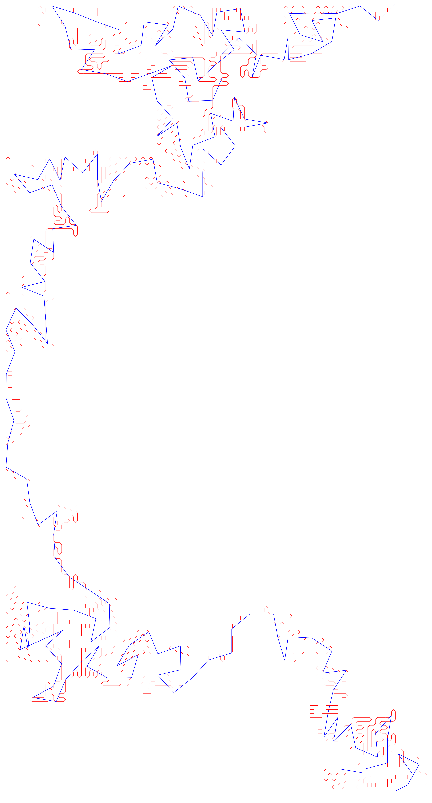

# ``Hull`` class: computing and analyzing hulls with boundaries

This program takes a thermalized boundaried ``CMGrid`` instance in order to determine the hulls of the two largest clusters, as well as run statistical analysis over them such as yardstick methods, measuring lengths, sandbox algorithms, etc. 

## Terminology
* **Hull (or complete hull)**: strictly speaking, the set of bonds touching the cluster that can be connected to infinity without crossing the cluster. In practice, we use the word to describe the graph intuitively connecting those bonds
* **Accessible perimeter (ap, or external hull)**: same process as for the complete hull, only applied to a densified version of the cluster where all neighboring sites that are part of the cluster gain a bond between them.

## Main class: ``Hull``
Takes as arguments a pre-thermalized boundaried ``CMGrid``, and is able to determine their external and complete hulls as well as the associated graphs. It can also write and read saved hull files as well as display a variety of associated information. Most functions are intuitive or simply auxiliary to the main ones, who are listed below

### Functions

* ``new_determine_hull()`` and ``determine_ap()`` determine the hulls using a depth-first search algorithm to ascertain whether a bond is connected to infinity without crossing the cluster (this involves using a finer grid to navigate correctly between bonds). The information is stored in the ``hull``, ``ap``, ``hull_points`` and ``ap_points`` data structures

* ``link_hull()``, ``link_ap()`` are used once the external and complete hulls have been determined and we now need to link the bonds intuitively to form a graph. The graphs are stored in ``linked_ap`` and ``linked_hull``

* ``yardstick(vector<float> radii)`` and ``yardstick_ap(vector<float> radii)`` take a list of yardstick lengths as a function and output the measurements of ``linked_hull`` and ``linked_ap`` using yardsticks of the specified lengths

### Algorithms

Different algorithms are used to analyse the fractality of the hull graphs. In particular we focus on the width and the length of this fractal in the roughness and size-length methods, as well as the yardstick-measured length in the yardstick method. 

#### Yardstick algorithm
The yardstick algorithm starts by drawing a circle of length $r$ around the first point of the graph. It will in turn intersect the graph at several points: to pick the right point, we measure the graph-length between this point and the original point. For the complete hull, we pick the closest point, and for the external hull, we pick the furthest point. We add $r$ to our measured length, and we iterate the process until the entire graph has been measured. We then repeat this for several values of $r$, and plot the measured lengths as a function of it. The slope of this graph in log-log space is equal to $1-d$, where $d$ is the fractal dimension of the graph.

#### Size-length method

Another method to determine the fractal dimension of a self-similar graph is to look at the growth of its hull’s length as a function of the grid size. It should take the form:
$L(s) = e^{ds+c}$
with $L$ the hull length, $s$ the size of the grid, and $d$ the fractal dimension of the hull. A simple linear fit in log-log space is therefore sufficient to extract the fractal dimension. Since we are interested in the general behaviour of the system, we average over many samples and fit that instead.

#### Roughness exponent

Another important element in our analysis is the roughness coefficient of the curves. They are defined as the log-log slope of graph width $w$ as a function of grid size. The width is defined as the standard deviation of the graph points’ column from the average.
